# Authorization Service (Real Estate Rental Project)

The **Authorization Service** is a centralized security microservice built with **Spring Authorization Server**. It manages identity, authentication, and token issuance for the entire ecosystem, ensuring secure access to resources through modern OAuth2.

## 🛡️ Security Features

### 1. Spring Authorization Server
This service leverages the power of Spring Authorization Server to provide a robust and flexible security layer. It handles:
- **Token Issuance**: Generates signed JWT (JSON Web Tokens) for authenticated users.
- **Custom Grant Types**: Implements a unique `metamask` grant type for Web3-based authentication.
- **Protocol Support**: Fully compliant with OAuth2.

### 2. High Security & Token Rotation
To guarantee maximum security, the service implements strict token management:
- **Refresh Token Rotation**: Every time a refresh token is used to obtain a new access token, the old refresh token is invalidated and a new one is issued. This prevents replay attacks and ensures that a stolen refresh token has a limited window of use.
- **Dynamic Key Management**: Automatically generates and persists RSA key pairs for JWT signing.
- **JWKS Endpoint**: Exposes public keys via the `/oauth2/jwks` endpoint, allowing other microservices (Resource Servers) to securely verify the authenticity of tokens without sharing private secrets.

### 3. Verification & Safety
The service is designed to simplify the validation logic for other services:
- **Simplified Verification**: Resource servers can easily fetch the public keys from the JWKS URI to validate JWT signatures.
- **Safe Exposure**: Only the necessary endpoints are exposed publicly, while sensitive configuration and private keys are protected.

## 🏗️ Architecture & Token Flow (Zero-Trust Model)

This service is the heart of a **Zero-Trust Security Model**. Instead of microservices trusting the gateway, each service independently verifies the identity of the requester.

```mermaid
sequenceDiagram
    participant User as 👤 User / MetaMask
    participant Gateway as 🚪 API Gateway
    participant Auth as 🔐 Auth Service (SAS)
    participant Service as 🏠 Property/Rental Services

    User->>Auth: 1. Request Token (grant_type=metamask)
    Auth-->>User: 2. Return JWT (Access + Refresh)

    User->>Gateway: 3. Call API with JWT
    Gateway->>Gateway: 4. Route Request
    Gateway->>Service: 5. Forward Request + JWT

    Note over Service, Auth: Zero-Trust Verification
    Service->>Auth: 6. Fetch Public Keys (/oauth2/jwks)
    Auth-->>Service: 7. Return JWKS
    Service->>Service: 8. Validate JWT Signature & Claims
    Service-->>User: 9. Return Protected Resource
```

### Key Workflow Steps:
1.  **Authentication**: The user authenticates once with the Auth Service.
2.  **Token Forwarding**: The API Gateway acts as a clean entry point, forwarding the JWT to downstream services.
3.  **Independent Verification**: Downstream services (`property-service`, `rental-agreement-service`, etc.) do not rely on the Gateway's word. They fetch public keys from the **JWKS** endpoint to cryptographically verify the token themselves.
4.  **Security**: If the Auth Service rotates keys (using the dynamic key management described above), microservices automatically fetch the new keys, ensuring seamless rotation without downtime.

## ⚙️ Configuration Management

The service follows a centralized configuration pattern to ensure consistency across environments.

- **Config Service**: This micorservice (auth-server) acts as a client to the [Real Estate Rental Config Service](https://github.com/RealEstate-Rental-Project/config-service-rental-estate), fetching its configuration at startup.
- **Configuration Repository**: The actual configuration files are managed centrally in the [Remote Config Repo](https://github.com/RealEstate-Rental-Project/config-repo-estate-rental).

### External Configuration Files
The service fetches its specific configuration from the following files in the repo:
- `auth-server.yml`: Base configuration shared across all environments.
- `auth-server-dev.yml`: Development-specific settings (e.g., local database, debug logging).
- `auth-server-prod.yml`: Production-optimized settings (e.g., restricted CORS, secure issuer URLs).

## 🚀 Key Endpoints

| Endpoint | Description |
| :--- | :--- |
| `/oauth2/token` | Obtain access and refresh tokens (supports `metamask` & `refresh_token` grants). |
| `/oauth2/jwks` | Retrieve public keys for token verification. |
| `/oauth2/authorize` | Authorization endpoint (if used for OIDC flows). |
| `/userinfo` | OIDC UserInfo endpoint. |
| `/actuator/health` | Service health status. |
| `/actuator/prometheus` | Metrics for monitoring. |

## 🛠️ Technical Stack
- **Java 17**
- **Spring Boot 3.4.1**
- **Spring Authorization Server**
- **Spring Cloud Config (Client)**
- **Web3j** (for MetaMask signature verification)
- **Nimbus JOSE + JWT**

## 🔧 Environment Variables
Ensure the following variables are configured (especially for production):
- `CONFIG_SERVER_URL`: URL of the centralized configuration server.
- `JWT_PRIVATE_KEY` / `JWT_PUBLIC_KEY`: (Optional) PEM-encoded keys to override automatic generation.
